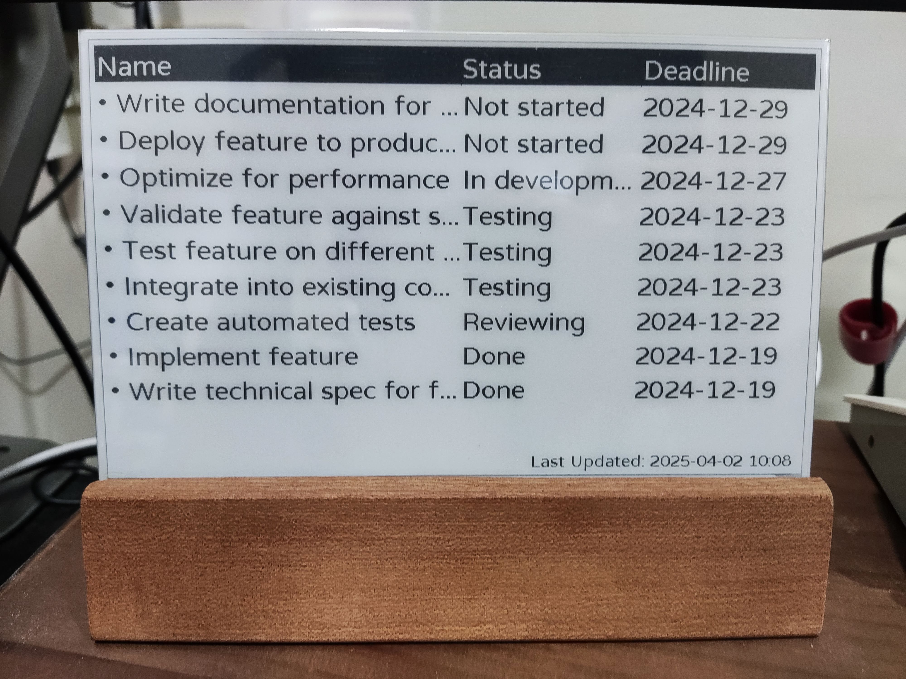
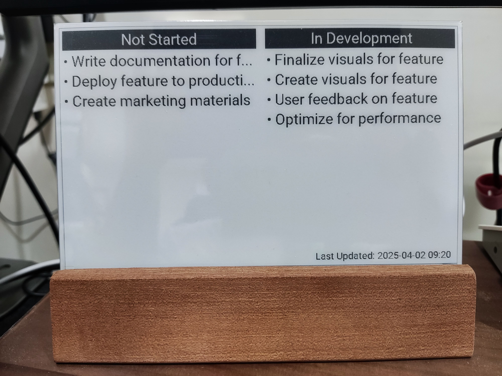

# ESPHome Notion Database Component

This ESPHome component allows you to retrieve data from a Notion database and display it on a display.

**Warning:** Due to the memory requirements of SSL, JSON parsing, display buffer, and handling data from the Notion database component, it is highly recommended to use a microcontroller with PSRAM (Pseudo Static RAM) to avoid crashes or WiFi disconnections.

**Note:** Using large fonts or a large number of characters can consume significant flash space due to font storage requirements. To address this, consider using an MCU with larger flash memory or removing the OTA partition to free up additional space.




## Components

### `notion_database`

This component retrieves data from a Notion database using the Notion API.

#### Configuration Variables:

*   **`id`** (Required, [ID](https://esphome.io/guides/configuration-types.html#config-id)): The id to use for this component.
*   **`api_token`** (Required, [Templatable](https://esphome.io/guides/configuration-types.html#config-templatable)): The API token to use to authenticate with the Notion API.
*   **`database_id`** (Required, [Templatable](https://esphome.io/guides/configuration-types.html#config-templatable)): The ID of the Notion database to retrieve data from.
*   **`query`** (Optional, [Templatable](https://esphome.io/guides/configuration-types.html#config-templatable)): A JSON string that specifies the query to use to retrieve data from the Notion database. See the [Notion API documentation](https://developers.notion.com/reference/post-database-query) for more information on the query format.
*   **`property_filters`** (Optional, list of [string](https://esphome.io/guides/configuration-types.html#config-string)): A list of property names to filter the data by. If this is not specified, all properties will be stored in RAM.
*   **`watchdog_timeout`** (Optional, [Time](https://esphome.io/guides/configuration-types.html#config-time)): The amount of time to wait for a response from the Notion API before triggering the watchdog. Defaults to `15s`.
*   **`http_connect_timeout`** (Optional, [Time](https://esphome.io/guides/configuration-types.html#config-time)): The amount of time to wait for a connection to the Notion API before timing out. Defaults to `5s`.
*   **`http_timeout`** (Optional, [Time](https://esphome.io/guides/configuration-types.html#config-time)): The amount of time to wait for a response from the Notion API before timing out. Defaults to `10s`.
*   **`json_parse_buffer_size`** (Optional, [Data Size](https://esphome.io/guides/configuration-types.html#config-data-size)): The size of the buffer to use to parse the JSON response from the Notion API. Defaults to `20kB`. Adjust this value based on the available heap or PSRAM size to ensure stability.
*   **`update_interval`** (Optional, [Time](https://esphome.io/guides/configuration-types.html#config-time)): The interval to poll the Notion API for changes. Defaults to `60s`.

#### Automation

##### Automation Triggers:

*   **`on_page_change`**: This trigger is activated whenever the query results are updated. It compare the `id` and `last_edited_time` of the retrieved data to detect changes.

##### Actions:

*   **`notion_database.first_page`**: Fetches the first page of the query results.
*   **`notion_database.next_page`**: Fetches the next page of the query results.
*   **`notion_database.prev_page`**: Fetches the previous page of the query results.

#### Supported Property Types

The `notion_database` component currently supports the following Notion property types:

*   `title`
*   `rich_text`
*   `number`
*   `select`
*   `multi_select`
*   `date`
*   `checkbox`
*   `url`
*   `email`
*   `phone_number`
*   `created_time`
*   `last_edited_time`

**Note:** This list is based on common Notion property types.

### `notion_database_table_view`

This component displays data from a `notion_database` component in a table format on a display.

#### Configuration Variables:

*   **`id`** (Required, [ID](https://esphome.io/guides/configuration-types.html#config-id)): The id to use for this component.
*   **`notion_database_id`** (Required, [ID](https://esphome.io/guides/configuration-types.html#config-id)): The id of the `notion_database` component to retrieve data from.
*   **`columns`** (Optional, list of [string](https://esphome.io/guides/configuration-types.html#config-string)): A list of column names to display in the table. If this is not specified, all columns will be displayed.
*   **`column_widths`** (Optional, list of [int](https://esphome.io/guides/configuration-types.html#config-int)): A list of column widths to use for the table. If this is not specified, the column widths will be calculated automatically.
*   **`line_height`** (Optional, [Templatable](https://esphome.io/guides/configuration-types.html#config-templatable), [int](https://esphome.io/guides/configuration-types.html#config-int)): The height of each line in the table, in pixels. Defaults to `40`.
*   **`title`** (Optional, [Templatable](https://esphome.io/guides/configuration-types.html#config-templatable), [string](https://esphome.io/guides/configuration-types.html#config-string)): The title to display above the table. Defaults to `""`.
*   **`enable_title`** (Optional, [Templatable](https://esphome.io/guides/configuration-types.html#config-templatable), [boolean](https://esphome.io/guides/configuration-types.html#config-boolean)): Whether to display the title above the table.
*   **`invert_title_color`** (Optional, [Templatable](https://esphome.io/guides/configuration-types.html#config-templatable), [boolean](https://esphome.io/guides/configuration-types.html#config-boolean)): Whether to invert the title color. Defaults to `true`.
*   **`enable_header`** (Optional, [Templatable](https://esphome.io/guides/configuration-types.html#config-templatable), [boolean](https://esphome.io/guides/configuration-types.html#config-boolean)): Whether to display the header row in the table. Defaults to `true`.
Defaults to `false`.
*   **`invert_header_color`** (Optional, [Templatable](https://esphome.io/guides/configuration-types.html#config-templatable), [boolean](https://esphome.io/guides/configuration-types.html#config-boolean)): Whether to invert the header color. Defaults to `true`.
*   **`enable_grid_line`** (Optional, [Templatable](https://esphome.io/guides/configuration-types.html#config-templatable), [boolean](https://esphome.io/guides/configuration-types.html#config-boolean)): Whether to display grid lines in the table. Defaults to `true`.
*   **`text_overflow`** (Optional, [Templatable](https://esphome.io/guides/configuration-types.html#config-templatable), [enum](https://esphome.io/guides/configuration-types.html#config-enum)): The text overflow mode to use for the table. Defaults to `ELLIPSIS`.
    *   `ELLIPSIS`: Truncate the text and add an ellipsis (`...`) to the end.
    *   `CLIP`: Truncate the text.
*   **`date_format`** (Optional, [Templatable](https://esphome.io/guides/configuration-types.html#config-templatable), [string](https://esphome.io/guides/configuration-types.html#config-string)): The format to use for dates. Defaults to `"%Y-%m-%d"`. See [strftime documentation](https://en.cppreference.com/w/cpp/chrono/c/strftime) for formatting options.
*   **`datetime_format`** (Optional, [Templatable](https://esphome.io/guides/configuration-types.html#config-templatable), [string](https://esphome.io/guides/configuration-types.html#config-string)): The format to use for datetimes. Defaults to `"%Y-%m-%d %H:%M"`. See [strftime documentation](https://en.cppreference.com/w/cpp/chrono/c/strftime) for formatting options.
*   **`enable_list_style`** (Optional, [Templatable](https://esphome.io/guides/configuration-types.html#config-templatable), [boolean](https://esphome.io/guides/configuration-types.html#config-boolean)): Whether to enable list styling for the first column. Defaults to `false`.
*   **`list_style_type`** (Optional, [Templatable](https://esphome.io/guides/configuration-types.html#config-templatable), [string](https://esphome.io/guides/configuration-types.html#config-string)): The list style type to use for the first column. Defaults to `"• "`.

#### Example:

```yaml
external_components:
  - source: github://parkghost/esphome-notion-database
    components: [notion_database, notion_database_table_view]

notion_database:
  - id: db1
    api_token: !secret notion_api_token
    database_id: xxxxxxxxxxxxxxxxxxxxxxxxxxxxxxxxxxxxxxx
    update_interval: 1min
    query: |-
      {
        "filter":{
            "property":"Status",
            "status":{
              "equals":"Read"
            }
        },
        "sorts":[
            {
              "timestamp":"last_edited_time",
              "direction":"ascending"
            }
        ],
        "page_size":20
      }
    property_filters:
      - Name
      - Author
      - Genre
    on_page_change:
      then:
        - component.update: my_display

notion_database_table_view:
  - id: view1
    notion_database_id: db1
    columns:
      - Name
      - Author
      - Genre
    column_widths:
      - 400
      - 200
      - 200
    line_height: 40
    title: "Reading Tracker"
    enable_title: true
    invert_title_color: true
    enable_header: true
    invert_header_color: false
    enable_grid_line: true

button:
  - platform: template
    name: "Query - Execute"
    on_press:
      - component.update: db1

  - platform: template
    name: "Query - First Page"
    on_press:
      - notion_database.first_page: db1

  - platform: template
    name: "Query - Previous Page"
    on_press:
      - notion_database.prev_page: db1

  - platform: template
    name: "Query - Next Page"
    on_press:
      - notion_database.next_page: db1

font:
  - file: "gfonts://Roboto"
    id: roboto_30
    size: 30

spi:
  clk_pin: GPIO12
  mosi_pin: GPIO11

display:
  - platform: waveshare_epaper
    id: my_display
    model: gdey075t7
    reset_pin: GPIO13
    dc_pin: GPIO14
    cs_pin: GPIO10
    busy_pin: GPIO9
    rotation: 0
    update_interval: never
    full_update_every: 10
    lambda: |-
      id(view1).draw(it, 0, 0, it.get_width(), it.get_height(), id(roboto_30), COLOR_ON, COLOR_OFF);
```

## Obtaining an API Token and Binding a Database

1.  **Create a Notion Integration:**
    *   Go to [https://www.notion.so/my-integrations](https://www.notion.so/my-integrations) and click "Create new integration".
    *   Give your integration a name and select the workspace you want to associate it with.
    *   Submit the form. You'll be presented with your "Internal Integration Token". This is your `api_token`.  Treat this token like a password and keep it secure.

2.  **Share the Database with your Integration:**
    *   Go to the Notion database you want to use with this component.
    *   Click the "..." button in the top right corner.
    *   Click the "Connections" menu item, search for the name of your integration.
    *   Confirm the integration access.  This allows the integration to query the database.

3.  **Obtain the Database ID:**
    *   The Database ID is part of the URL when you view your database in a browser.
    *   For example, if the URL is `https://www.notion.so/your-workspace/xxxxxxxxxxxxxxxxxxxxxxxxxxxxxxxx?v=yyyyyyyyyyyyyyyyyyyyyyyyyyyyyyyy`, then the Database ID is `xxxxxxxxxxxxxxxxxxxxxxxxxxxxxxxx`.


## Further Information

*   [Notion API Documentation](https://developers.notion.com/)
*   [Waveshare E-Paper Display](https://esphome.io/components/display/waveshare_epaper.html)
*   [More E-Paper Display](https://github.com/parkghost/esphome-epaper)
